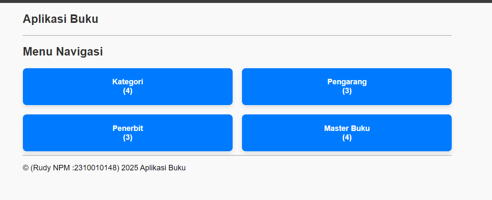
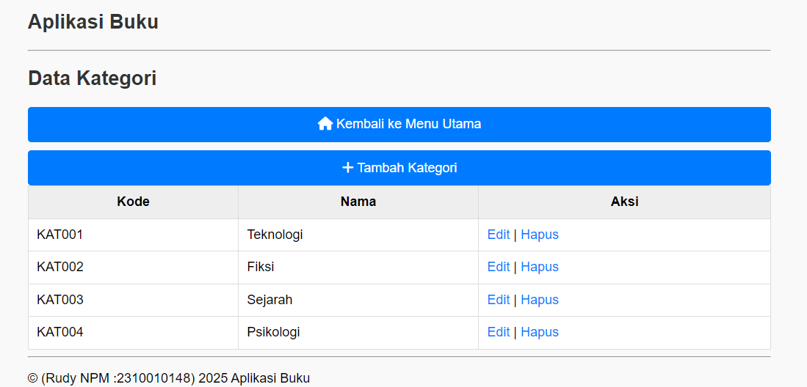

# 📚 BukuShelf - Aplikasi Manajemen Buku

  
📦 *Aplikasi web sederhana untuk manajemen koleksi buku — cocok buat perpustakaan mini, katalog pribadi, atau tugas kuliah.*

---

## 🚀 Fitur Utama

✅ Menampilkan daftar buku lengkap  
✅ Tambah buku baru ke koleksi  
✅ Edit detail buku (judul, penulis, tahun, dsb)  
✅ Hapus buku dari daftar  
✅ Pencarian berdasarkan judul / kategori _(opsional)_  

---

## 🛠️ Teknologi

- 🐘 PHP Native
- 🛢️ MySQL / MariaDB
- 🖌️ HTML5 + CSS3
- ⚡ JavaScript
- 🎨 Bootstrap (opsional)

---

## 🧪 Cara Instalasi

1. Clone atau download repositori ini
2. Pindahkan ke folder `htdocs` (XAMPP) atau `www` (Laragon)
3. Buat database di **phpMyAdmin**
4. Import file SQL dari folder `database/`  
   > Contoh: `database/bukushelf.sql`
5. Edit konfigurasi database di `koneksi.php`
6. Jalankan aplikasi melalui browser:  
   `http://localhost/bukushelf/`

---

## 🖼️ Preview Aplikasi

<table>
  <tr>
    <td></td>
    <td></td>
  </tr>
  <tr>
    <td align="center">Halaman Utama</td>
    <td align="center">Form Tambah Buku</td>
  </tr>
</table>

